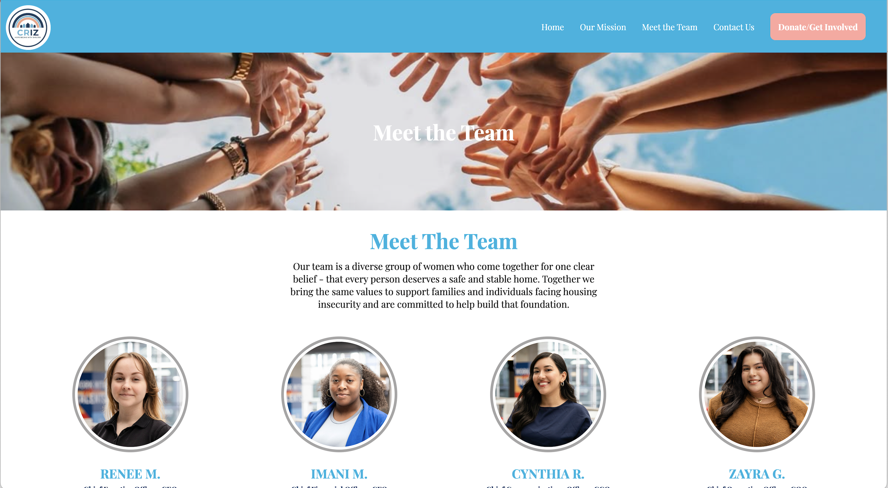

# CRIZ – Community, Resilience, Inclusion, and Zeal

This website was created as part of a class project to represent a fictional non-profit organization dedicated to addressing housing insecurity. The goal of the site is to demonstrate web design, development, and communication skills by presenting a realistic example of how a non-profit might share its mission, programs, and community impact online. 

Note: This organization and website are entirely fictional and created for educational purposes only.

## Description

The site includes five main pages — Home, About, Mission, Get Involved, and Contact — each designed to reflect how a real-world non-profit might share its story, engage supporters, and encourage community involvement.

The website follows a mobile-first design approach, ensuring it is fully responsive and accessible across different screen sizes and devices. Accessibility best practices were considered throughout development to make the content inclusive for all users.

The layout includes consistent header and footer components for easy navigation and a cohesive user experience. Interactive features, such as JavaScript form validation, were implemented to enhance functionality and demonstrate client-side scripting skills.

## Getting Started

### Installing

* Fork and Clone the application

### Executing program

```
cd CRIZ

open home/home.html
```


## Authors




* [Imani Moore](https://github.com/ImaniMoore) </br>
* [Cynthia Rincon](http://www.linkedin.com/in/cynthia-r-0299a2191) </br>
* [Zayra Guerrero Camarillo](https://www.linkedin.com/in/zayraadileneguerrerocamarillo) </br>
* [Renee Messersmith](https://www.linkedin.com/in/reneemessersmith/)

